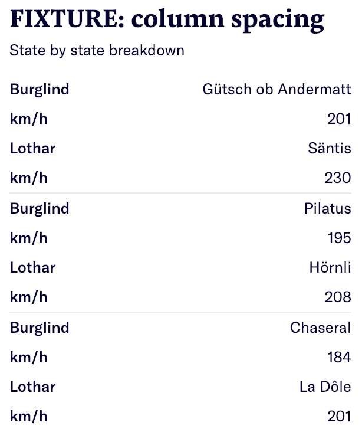

# [tool-name] <travis-badge>

**maintainer**: <maintainer>

Short description of tool and link to either [demo](https://editor.q.tools/) or [playground](https://q-playground.st.nzz.ch).

## Table of contents

- [Installation](#installation)
- [Configuration](#configuration)
- [Development](#development)
  - [Watching files](#watching-files-dev)
- [Testing](#testing)
- [Deployment](#deployment)
- [Functionality](#functionality)
- [License](#license)

## Installation

```
nvm use
npm install
npm start
```

[to the top](#table-of-contents)

## Configuration

If env variables, explained here

## Development

Start the Q dev server:

```
npx @nzz/q-cli server
```

Run the Q tool:

```
npm start
```

## Watching files (DEV)

Please see nodemon.json for a specific list of extension that trigger a rebuilt when changed in development. You can extend this list at your liking.

[to the top](#table-of-contents)

## Testing

Run the tests:

```
npm run test
```

### Implementing a new test

When changing or implementing...

- A `route`, it needs to be tested in the `tests/e2e-tests.js` file.
- Something on the frontend, it needs to be tested in it's own  `***.spec.ts` file.

[to the top](#table-of-contents)

## Deployment

We provide automatically built docker images at https://hub.docker.com/r/nzzonline/[tool-name]/.
There are three options for deployment:

- Use the provided images
- Build your own docker images
- Deploy the service using another technology

### Use the provided docker images

1. Deploy `nzzonline/[tool-name]` to a docker environment
2. Set the ENV variables as described in the [configuration section](#configuration)

[to the top](#table-of-contents)

## Functionality

The tool structure follows the general structure of each Q tool. Further information can be found in [Q server documentation - Developing tools](https://nzzdev.github.io/Q-server/developing-tools.html).

[to the top](#table-of-contents)

### Options

All options should be listed and explained. The varieties should be listed. If there's a visual aspect, a printscreen would be nice. The options should be listed as they are named in the `schema`
The printscreen can be implemented as following:



[to the top](#table-of-contents)

## License (if open source)

Adding the license + updating the year.
